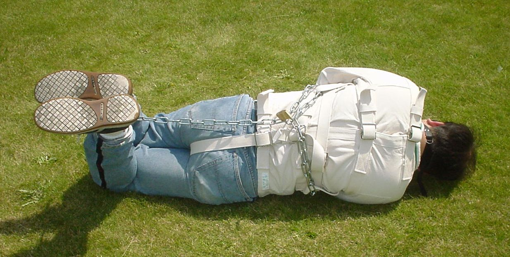
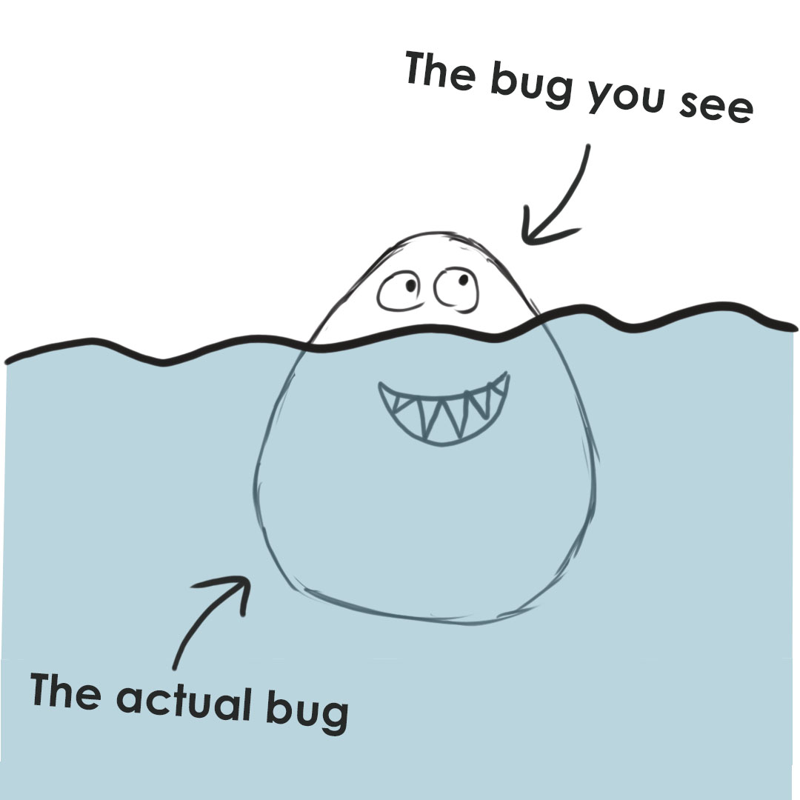

= Rust for RTP

== What is Rust?

== !


== Why?

== !


== How?
[.step]
* Strong types (Curry-Howard correspondance)
** Types as formulas
* No Data Race
    ** Concurrent writes are forbidden
* Scoped data (No GC)
    ** Data moved into scopes
    ** Data with no scope is auto-reclaimed
* ADT & Pattern matching
* Generics
* Native (via llvm)

== Rust however
* Doesn't prevent deadlocks
* Doesn't prevent bad logic
* is verbose
* Has an incomplete macro system

== Ownership
* Data is owned by a scope:
** Structure/Enum
** Function
** Expression

== Ownership
[.step]

```
fn take_a(v: Vec<u32>) {
    println!("{:?}", v);
}

fn main() {
    let a = vec!{1, 2, 3, 4};
    take_a(a);
}
```
```
$ cargo run
[1, 2, 3, 4]
```

== Ownership

```
fn take_a(v: Vec<u32>) {
    println!("{:?}", v);
}

fn main() {
    let a = vec!{1, 2, 3, 4};
    take_a(a);
    take_a(a); // <-- use again?
}
```

== Ownership
```
7 |     let a = vec!{1, 2, 3, 4};
  |         - move occurs because `a` has type `Vec<u32>`, which does not implement the `Copy` trait
8 |     take_a(a);
  |            - value moved here
9 |     take_a(a);
  |            ^ value used here after move
```

== Borrowing
[.step]
```
#[derive(Debug)]
enum StringOrInt {
    Str(String),
    Int(i64),
}
use StringOrInt::*;
fn main() {
    let mut x = Str("Hello".to_string());

    match &mut x {
        Str(s) => { *s = "World".to_string() },
        Int(_) => { },
    }

    let y = &mut x;
    println!("{:?}", y);
}

```

```
$ cargo run
Str("World")
```

== Borrowing
[.step]
```
#[derive(Debug)]
enum StringOrInt {
    Str(String),
    Int(i64),
}
use StringOrInt::*;
fn main() {
    let mut x = Str("Hello".to_string());

    match &mut x {
        Str(s) => { *s = "World".to_string() },
        Int(_) => { },
    }

    let y = &mut x;
    println!("{:?}", y);
}

```

```
$ cargo run
Str("World")
```

== Borrowing
```
#[derive(Debug)]
enum StringOrInt {
    Str(String),
    Int(i64),
}

use StringOrInt::*;

fn main() {
    let mut x = Str("Hello".to_string());
    let y = &mut x;

    match &mut x {
        Str(s) => {
            *y = Int(10); // <- mutate y
            println!("{}", s); // <- reference the old string! BAD!
        },
        Int(_) => { },
    }
}
```

== Borrowing
```
   |
25 |     let y = &mut x;
   |             ------ first mutable borrow occurs here
26 |
27 |     match &mut x {
   |           ^^^^^^ second mutable borrow occurs here
28 |         Str(s) => {
29 |             *y = Int(10);
   |             -- first borrow later used here
```

== Lifetime
```
fn get_ref() -> &String {
    let s = "Hello World".to_string();
    &s // <- s will be destroyed after returning
       // dangling reference
}

fn main() {
    println!("{}", get_ref());
}
```

== Lifetime
```
  |
1 | fn get_ref() -> &String {
  |                 ^ expected named lifetime parameter
  |
```

== THE END
